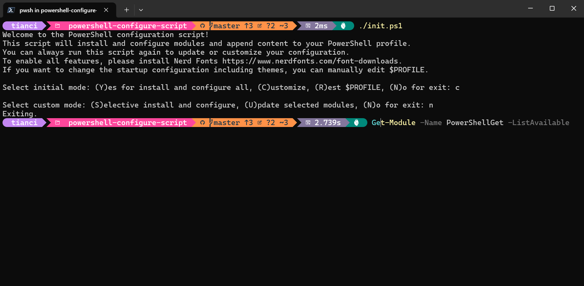

**English** | [简体中文](README_zh.md) 

# PowerShell Configuration Script

This repository contains a PowerShell script to install and configure various modules and append content to your PowerShell profile.



## Features

- Install and configure PowerShell modules
- Append custom content to your PowerShell profile
- Easy to customize and extend

## How to Use

1. Clone the repository:
    ```sh
    git clone https://github.com/EnderturtleOrz/powershell-configure-script.git
    cd powershell-configure-script
    ```

2. Change Script Policy as an administrator:
    ```sh
    Set-ExecutionPolicy RemoteSigned -Scope CurrentUser
    ```

3. Run the script as an administrator:
    ```sh
    ./init.ps1
    ```

4. Follow the on-screen instructions to install and configure the modules.


## Requirements

- PowerShell 5.1 or later
- Administrator privileges to change the execution policy

## Module List

See [config/README.md](config/README.md).

## FAQ

1. **Fonts not displaying correctly?**
   - The `oh-my-posh` module requires Nerd Fonts to enable all features. You can download Nerd Fonts from [Nerd Fonts](https://www.nerdfonts.com/font-downloads).

## License

This project is licensed under the MIT License - see the [LICENSE](LICENSE) file for details.

## How to Contribute?

Configures and other modules? see [config/README.md](config/README.md).

Contributions are welcome! Please open an issue or submit a pull request.

## Star History

[](https://star-history.com/#EnderturtleOrz/powershell-configure-script&Date)